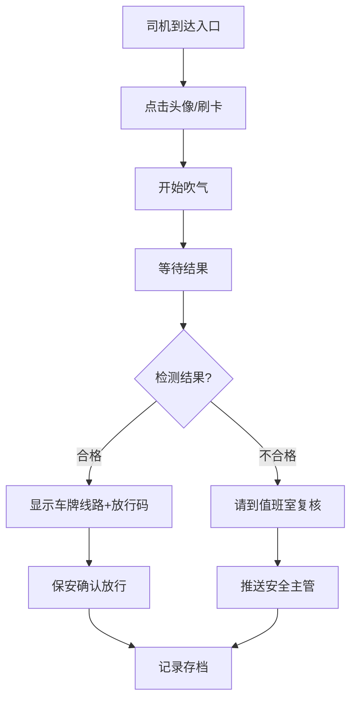

## 1. 产品概述

校车场站入口酒测登记终端，面向年龄偏大的驾驶员和门岗保安，通过极简的三步操作完成酒精检测与进场登记，防止司机绕过晨检直接取车，保障校车运营安全。

- 核心价值：简化操作流程，降低中老年用户使用门槛，通过语音和大字提示确保无障碍使用
- 目标用户：50-60岁校车驾驶员、场站门岗保安、安全管理人员

## 2. 核心功能

### 2.1 用户角色

| 角色 | 身份识别方式 | 核心权限 |
|------|--------------|----------|
| 驾驶员 | 头像选择/刷IC卡 | 完成酒测、查看放行信息 |
| 门岗保安 | 管理员权限 | 查看排队、确认放行、异常处理 |
| 安全主管 | 后台推送 | 接收异常告警、查看历史记录 |

### 2.2 功能模块

1. **身份识别页**：驾驶员头像网格、刷卡感应区、排队信息侧栏
2. **酒测流程页**：三步状态提示（开始吹气→等待结果→通过可进场）
3. **结果展示页**：合格放行（车牌线路+放行码）、不合格提示（去值班室复核）
4. **保安管理区**：待检队列、已检记录、异常告警

### 2.3 页面详情

| 页面名称 | 模块名称 | 功能描述 |
|----------|----------|----------|
| 身份识别页 | 头像选择区 | 大尺寸驾驶员头像网格，点击即选中，配有姓名标注 |
| 身份识别页 | 刷卡感应区 | 常驻屏幕右下角，支持IC卡快速识别 |
| 身份识别页 | 保安侧栏 | 实时显示待检人数、下一位司机、已检数量 |
| 酒测流程页 | 状态指示器 | 超大字体三步进度，当前步骤高亮放大 |
| 酒测流程页 | 语音播报 | 每一步自动语音提示，支持重复播放按钮 |
| 结果展示页 | 合格放行卡 | 显示车牌、线路、司机姓名、放行码（支持打印） |
| 结果展示页 | 不合格提示 | 仅显示"请到值班室复核"，不展示具体数值 |
| 结果展示页 | 后台推送 | 异常记录自动推送给安全主管 |

## 3. 核心流程

驾驶员驾车到达场站入口 → 终端自动识别车辆并提醒检测 → 司机点击头像或刷卡确认身份 → 屏幕显示"开始吹气"+语音提示 → 司机吹气 → 屏幕显示"等待结果"+倒计时动画 → 检测合格：显示"通过可进场"+车牌线路+放行码 → 保安确认放行 → 记录存档。

若检测不合格：屏幕显示"请到值班室复核"，不显示具体数值 → 自动推送记录给安全主管 → 保安引导司机前往值班室。

## 4. 用户界面设计

### 4.1 设计风格

- **主色调**：深海军蓝（#165DFF）作为品牌色，代表专业可靠；鲜绿色（#00B42A）表示通过；橙红色（#F53F3F）表示异常
- **背景色**：极浅灰（#F7F8FA），减少视觉疲劳
- **按钮样式**：超大圆角（16px）、立体阴影、最小尺寸80px×80px便于触控
- **字体**：采用"思源黑体 Bold"，超大字号（64px-96px），字重加粗，高对比度
- **布局风格**：卡片式布局，大量留白，关键信息居中放大
- **图标风格**：圆润实心图标，避免复杂线条，使用🍺✅❌等直观emoji辅助

### 4.2 页面设计概述

| 页面名称 | 模块名称 | UI元素 |
|----------|----------|--------|
| 身份识别页 | 头像选择区 | 6列网格，头像120px×120px，姓名32px粗体，选中态蓝框高亮+放大动效 |
| 身份识别页 | 保安侧栏 | 右侧1/4宽度，白色卡片，排队人数72px大字，下一位司机信息卡 |
| 酒测流程页 | 状态指示器 | 竖排三步，当前步骤文字96px+图标120px，已完成步骤灰色淡出 |
| 酒测流程页 | 吹气动画 | 中央圆形呼吸灯动画，提示"请均匀吹气5秒" |
| 结果展示页 | 合格卡片 | 绿色边框，车牌号码96px，线路信息48px，放行码二维码居中 |
| 结果展示页 | 不合格卡片 | 橙色边框，"请到值班室复核"72px粗体，下方小字"保安将引导您" |

### 4.3 响应式

- **平板横屏优先**：1920×1080分辨率设计，适配10-15寸触控平板
- **触控优化**：所有可点击区域≥80px，间距≥20px，防止误触
- **无滚动设计**：单页展示所有信息，避免老年人滑动操作

### 4.4 无障碍设计

- 语音播报：所有状态变化自动语音（中文普通话，语速稍慢）
- 高对比度：文字与背景对比度≥7:1，符合WCAG AAA标准
- 操作反馈：每次点击都有震动反馈+声音提示
- 无超时强制：操作无时间限制，支持重复播报按钮
