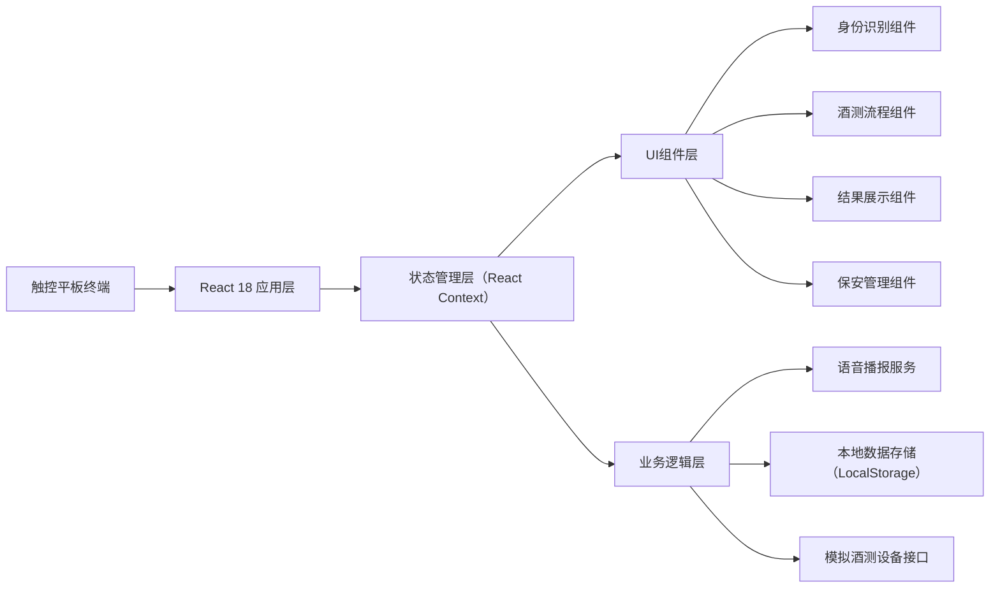
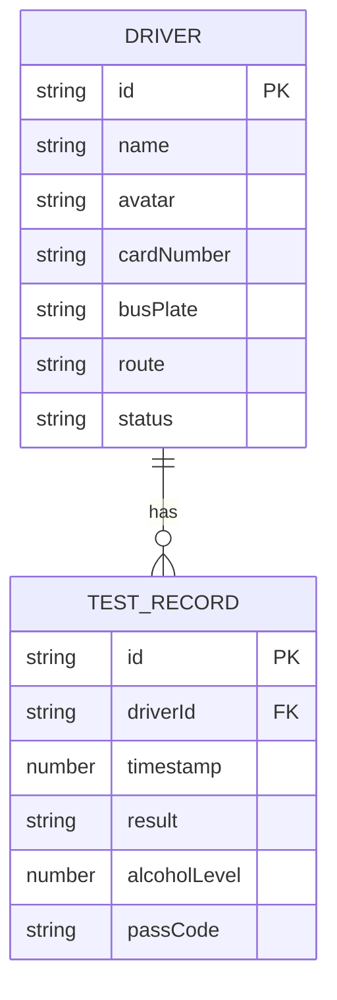

## 1. 架构设计

本项目为纯前端单页应用，部署在校车场站入口的触控平板上。所有业务逻辑和数据存储均在前端完成，无需后端服务，支持离线运行。



## 2. 技术描述

- **前端框架**：React@18 + TypeScript@5 + Vite@5
- **样式方案**：TailwindCSS@3（原子化CSS，快速构建UI）
- **状态管理**：React Context + useReducer（轻量级，避免过度设计）
- **语音播报**：Web Speech API（浏览器原生语音合成）
- **数据存储**：LocalStorage（本地持久化记录）
- **图标方案**：Lucide React（开源图标库，风格统一）
- **二维码生成**：qrcode.react（生成放行码）
- **构建工具**：Vite（快速热更新，适合开发调试）

## 3. 路由定义

| 路由 | 用途 |
|------|------|
| / | 主界面 - 身份识别 + 保安侧栏（默认页） |
| /test/:driverId | 酒测流程页 - 三步检测流程 |
| /result/:driverId | 结果展示页 - 合格/不合格展示 |

## 4. 类型定义

```typescript
// 驾驶员信息
interface Driver {
  id: string;
  name: string;
  avatar: string;
  cardNumber: string;
  busPlate: string;
  route: string;
  status: 'waiting' | 'testing' | 'passed' | 'failed';
}

// 检测记录
interface TestRecord {
  id: string;
  driverId: string;
  driverName: string;
  busPlate: string;
  timestamp: number;
  result: 'passed' | 'failed';
  alcoholLevel?: number; // 仅内部存储，不对外显示
  passCode?: string;
}

// 应用状态
interface AppState {
  drivers: Driver[];
  currentDriver: Driver | null;
  testStep: 'idle' | 'blow' | 'waiting' | 'result';
  testResult: 'passed' | 'failed' | null;
  records: TestRecord[];
  queuePosition: number;
}

// 酒测设备模拟接口
interface AlcoholTester {
  startBlowing: () => Promise<number>;
  stopBlowing: () => void;
}
```

## 5. 数据模型

### 5.1 数据模型定义



### 5.2 初始数据（Mock）

```typescript
// 模拟驾驶员数据
const mockDrivers: Driver[] = [
  {
    id: '1',
    name: '张建国',
    avatar: 'https://api.dicebear.com/7.x/avataaars/svg?seed=zhang',
    cardNumber: 'DRV001',
    busPlate: '京A·12345',
    route: '1号线：阳光小区→实验学校',
    status: 'waiting'
  },
  {
    id: '2',
    name: '李卫东',
    avatar: 'https://api.dicebear.com/7.x/avataaars/svg?seed=li',
    cardNumber: 'DRV002',
    busPlate: '京B·67890',
    route: '2号线：幸福里→中心小学',
    status: 'waiting'
  },
  {
    id: '3',
    name: '王和平',
    avatar: 'https://api.dicebear.com/7.x/avataaars/svg?seed=wang',
    cardNumber: 'DRV003',
    busPlate: '京C·11111',
    route: '3号线：花园邨→第一中学',
    status: 'waiting'
  },
  {
    id: '4',
    name: '赵解放',
    avatar: 'https://api.dicebear.com/7.x/avataaars/svg?seed=zhao',
    cardNumber: 'DRV004',
    busPlate: '京D·22222',
    route: '4号线：新兴街→附属小学',
    status: 'waiting'
  },
  {
    id: '5',
    name: '刘援朝',
    avatar: 'https://api.dicebear.com/7.x/avataaars/svg?seed=liu',
    cardNumber: 'DRV005',
    busPlate: '京E·33333',
    route: '5号线：春风里→实验二小',
    status: 'waiting'
  },
  {
    id: '6',
    name: '陈抗美',
    avatar: 'https://api.dicebear.com/7.x/avataaars/svg?seed=chen',
    cardNumber: 'DRV006',
    busPlate: '京F·44444',
    route: '6号线：朝阳路→第三中学',
    status: 'waiting'
  }
];
```

## 6. 组件结构

```
src/
├── App.tsx                 # 主应用入口
├── main.tsx               # 应用挂载
├── index.css              # 全局样式 + Tailwind
├── types/
│   └── index.ts           # TypeScript 类型定义
├── context/
│   └── AppContext.tsx     # 全局状态管理
├── data/
│   └── mockData.ts        # 模拟数据
├── hooks/
│   ├── useSpeech.ts       # 语音播报Hook
│   └── useAlcoholTest.ts  # 酒测流程Hook
├── components/
│   ├── DriverGrid.tsx     # 驾驶员头像网格
│   ├── CardReader.tsx     # 刷卡感应区
│   ├── SecuritySidebar.tsx # 保安侧栏
│   ├── TestProcess.tsx    # 酒测流程三步
│   ├── ResultPass.tsx     # 合格结果展示
│   ├── ResultFail.tsx     # 不合格结果展示
│   ├── PassCodeQR.tsx     # 放行码二维码
│   └── QueueItem.tsx      # 排队列表项
└── utils/
    ├── storage.ts         # 本地存储工具
    └── generatePassCode.ts # 放行码生成
```
